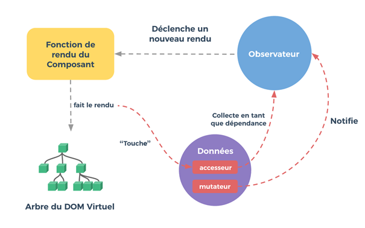

Vue.js

C’est quoi vue.js ?

Vue.js est un framework pour construire des applications et des sites web. Ce framework fournit des tas d’outils pour créer des sites web et des applications rapidement et dynamique. Vue.js est un dom virtuel. Le Dom virtuel crée essentiellement des applications web JavaScript. Vue.js est un framework très léger (10k gzip). Vue.js est un framework progressif car on peut l’utiliser n’importe où, on peut aussi ajouter un peu d’interactivité et l’utiliser comme une sorte de remplacement de jQuery.

Il est aussi flexible pour permettre de choisir les outils et autres bibliothèques qu’on veut implémenter ou on peut utiliser la vue fournit par défaut (Vue Ecosystem). 

Vue.js permet aussi de mettre à jour les anciennes applications page par page. 

v-for : permet de créer une boucle
v-model : deux conditions : un champ nommé «value» et il doit émettre un événement d’input avec la valeur attendue.
Vue.component() : création de composant directement créer dans le DOM (data, methods, app.component)
Methods : gestion des évènements 
v-on : pour écouter les évènements du DOM afin d’exécuter du JavaScript lorsque ces évènements surviennent.
v-if: condition 
Template : affichage du contenu
App.mount: c’est comme un return en php sans ça rien ne s’affiche

Node.js

Package.json : contient des métadonnées pertinentes pour le projet et est utilisé pour gérer les dépendances, les scripts, la version du projet etc. Pour le créer il existe deux manières avec npm depuis un terminal ou avec yarn init dans le terminal.
Il y a deux dossiers un public et un src le public peut contenir tous les ressources statiques, images, css et le dossier src contient les contrôleurs, la vue
Npm start permet de lancer le framework node

 2.
Démystifier les composants interne de vue.js

Le composant aura un template qui devra passer par différentes étapes avant d’apparaître dans le navigateur.
Le compilateur Vue permet de lire le modèle d’un composant et le fait passer par des étapes telles que l’analyse, l’optimisation, le codegen et crée finalement une fonction de rendu. Cette fonction de rendu est responsale de la création d’un Vnode qui est utilisé par le processus de correctif du DOM virtuel pour créer le DOM réel.
 

Etape d’analyse : analyse les directives similaires aux éléments et rend les directives structurelles telles que v-for, v-if sous forme de paires clé-valeur. La directif v-if sera poussée dans attrsMap en tant qu’objet dynamique et créer un Arbre de la syntaxe abstraite

Etape d’optimisation : permet de ne pas créer de nouveaux nœuds à chaque nouveau rendu mais ces nœuds seront complètement ignorés lors du processus de correction du DOM virtuel

Etape codeGen: création du rendu 

Observateur : analyse une expression, collecte les abonnées et déclenche un rappel lorsque la valeur de l’expression change pour chaque composant

 

Processus de correction : interagit avec le DOM réel à l’aide du DOM virtuel 

Le DOM virtuel (VDOM) est un concept de programmation dans lequel une représentation idéale, ou « virtuelle », d'une interface utilisateur (UI) est conservée en mémoire et synchronisée avec le DOM « réel » par une bibliothèque telle que ReactDOM. Ce processus s'appelle réconciliation.
DOM réel (create element) affiche
DOM virtuel(objet)

custom elements (les éléments personnalisés), une méthode vous permettant de définir vos propres éléments, avec leurs comportements et propriétés.
Vue. js est donc un framework JavaScript, utilisé pour la partie front-end, qui a l'avantage d'être très accessible. Il fonctionne sur la même ligne que React ou Angular. On y retrouve une approche orientée composants
Vue.js se relie avec un DOM(#app).

Vue.js utilise une implémentation de modèles basée sur DOM. Cela signifie que tous les modèles Vue.js sont essentiellement du code HTML valide et analysable, amélioré avec certains attributs spéciaux. Gardez cela à l'esprit, car cela rend les modèles Vue fondamentalement différents des modèles basés sur des chaînes.

Exemple :  
Exemple :  

Exemple :  
 
Un observateur dans Vue.js est une fonctionnalité spéciale qui permet de regarder un composant et d’effectuer des actions spécifiées lorsque la valeur du composant change. C’est un moyen plus générique d’observer et de réagir aux changements de données dans l’instance Vue. Les observateurs sont les plus utiles lorsqu’ils sont utilisés pour effectuer des opérations asynchrones.
